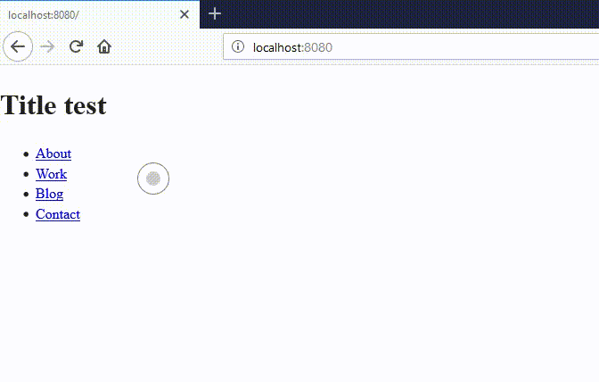

# SPA Node.js app
A production ready SPA / nodejs app with custom cursor enabled.

## Dev start

	C:\..\root> cd app
	C:\..\root\app> npm run dev:start

## Deploy

Build and get `_deploy` folder

    C:\..\root> cd app
	C:\..\root\app> npm run deploy:build
	C:\..\root\app> cd ..
	C:\..\root> _deploy.cmd 

Upload `_deploy` contents to `public_html` folder in server.

Start service:

	[~/public_html]# npm run deploy:start 